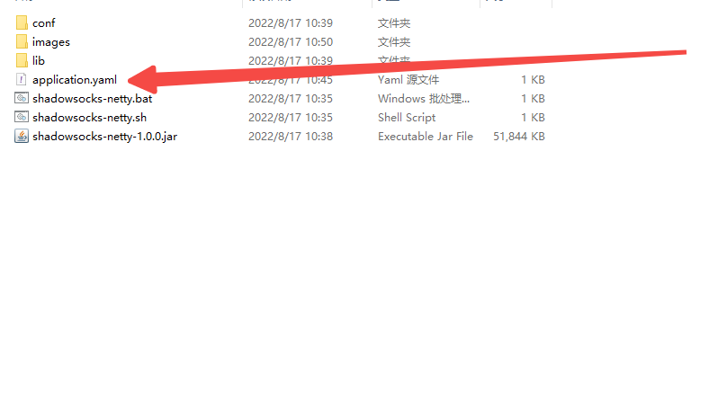
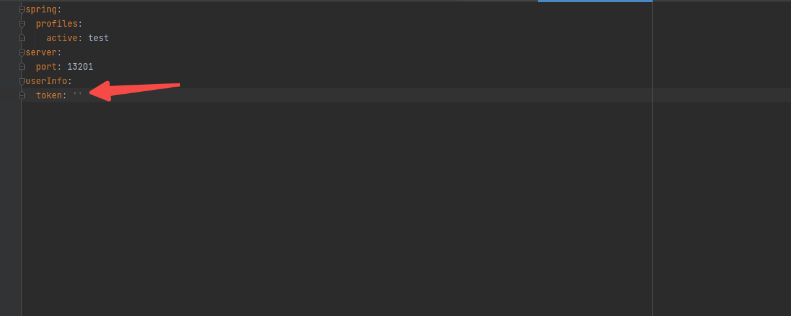
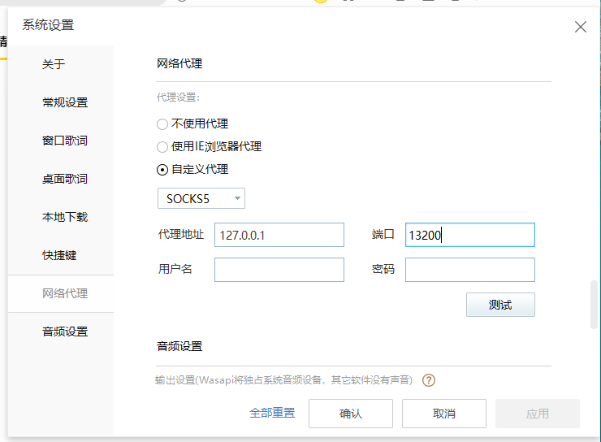
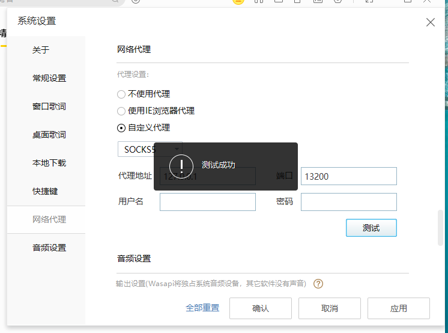
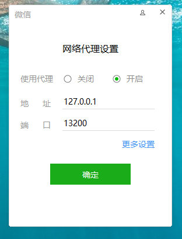

## 1. 介绍

该项目是基于Java Netty开发的Socks5代理客户端，功能类似于Shadowsocks 
实现网络代理请求。

## 2. 安装/部署

#### 2.1 软件依赖
- JDK 1.8

#### 2.2 安装
1. 克隆代码仓库到本地  
2. 联系我（qq:1015828419）获取token，将取得的token写入配置文件  
3. 执行bat文件
4. 完成

 

